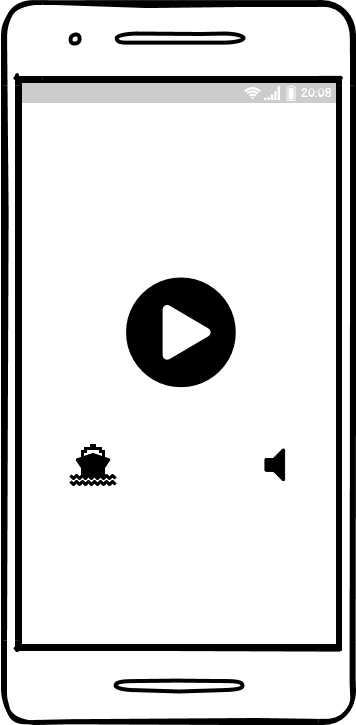
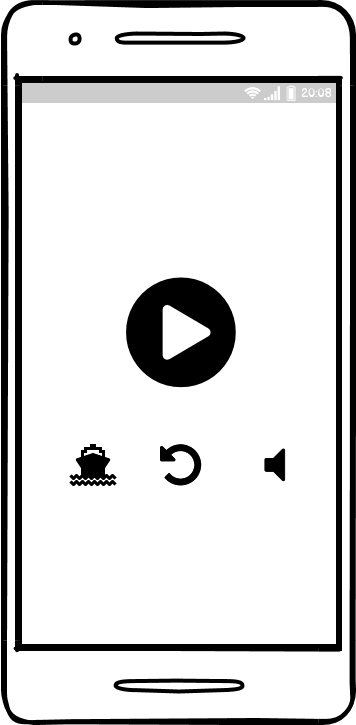
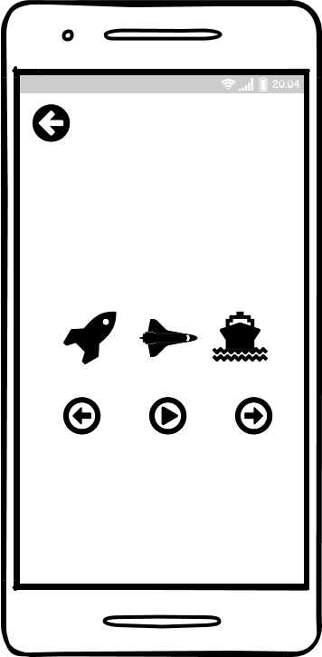
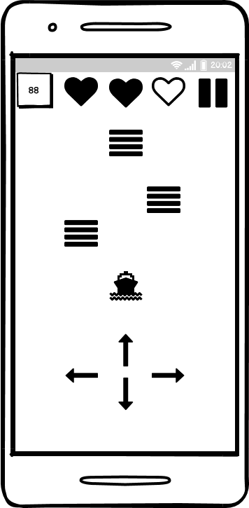

# Требования к проекту
---

# Содержание
1. [Введение](#intro)  
1.1 [Назначение](#appointment)  
1.2 [Бизнес-требования](#business_requirements)  
1.2.1 [Исходные данные](#initial_data)  
1.2.2 [Возможности бизнеса](#business_opportunities)  
1.3 [Аналоги](#analogues)  
1.3.1 [Row_Row](#Row_Row)
1.3.2 [Fun_Race_3D](#Fun_Race_3D)
1.4 [Правила игры](#Rools)
2. [Требования пользователя](#user_requirements)  
2.1 [Программные интерфейсы](#software_interfaces)  
2.2 [Интерфейс пользователя](#user_interface)  
2.2.1 [Интерфейс меню](#user_interface_menu) 
2.2.2 [Интерфейс меню паузы](#user_interface_pausemenu) 
2.2.3 [Интерфейс меню скинов](#user_interface_skinmenu) 
2.2.4 [Интерфейс игрового поля](#user_interface_game) 
2.3 [Характеристики пользователей](#user_specifications)  
2.3.1 [Аудитория приложения](#application_audience)  
2.3.1.1 [Целевая аудитория](#target_audience)  
2.3.1.1 [Побочная аудитория](#collateral_audience)  
2.4 [Предположения и зависимости](#assumptions_and_dependencies)  
3. [Системные требования](#system_requirements)  
3.1 [Функциональные требования](#functional_requirements)  
3.2 [Нефункциональные требования](#non-functional_requirements)  

<a name="intro"/>

# 1 Введение

<a name="appointment"/>

## 1.1 Назначение
Мобильная/десктопная игра "Super-boat 3D" для ОС Windows и Android. 

<a name="business_requirements"/>

## 1.2 Бизнес-требования

<a name="initial_data"/>

### 1.2.1 Исходные данные
В наше время игровая индустрия является большой частью IT-рынка. И все больше и больше людей интересуется не крупными проектами, за которыми можно провести не один вечер в компании себя и увлекательной истории, а мелкими инди-проектами, за которыми можно убить несколько минут времени в очереди, на скучной лекции или на обеденном перерыве в рабочее время.

<a name="business_opportunities"/>

### 1.2.2 Возможности бизнеса
Данное приложение может пользоваться популярностью самых разных групп пользователей - от детей до взрослых.

<a name = "analogues"/>

## 1.3 Аналоги

<a name = "Row_Row"/>

### 1.3.1 Row Row

**Русский интерфейс:** нет  
**Цена:**  бесплатно 
**Ссылка на страницу магазина:** https://play.google.com/store/apps/details?id=com.parttimemonkey.rowrow

Row Row - мобильная 3D игра, суть которой заключается в преодолении препядстий, управляя лодкой. 

<a name = "Fun_Race_3D"/>

### 1.3.2 Fun Race 3D

**Русский интерфейс:** нет  
**Цена:** бесплатно  
**Ссылка на страницу магазина:** https://play.google.com/store/apps/details?id=com.slippy.linerusher

Fun Race 3D - мобильная 3D игра в жанре гонок на полосе препядствий.

<a name = "Rools"/>

## 1.4 Правила игры

Игра состоит из уровней, каждый уровень имеет собственную длину и набор препятствий. Пользователю требуется пройти уровень, не израсходовав все очки здоровья. Уровень считается пройденным, если пользователь пересек финишную черту. 

# 2 Требования пользователя

<a name="software_interfaces"/>

## 2.1 Программные интерфейсы
Разработка будет вестись с использованием языка программировани C# и игрового движка UNITY. 

<a name="user_interface"/>

## 2.2 Интерфейс пользователя
Создаваемый программный продукт будет иметь классический графический пользовательский интерфейс.

<a name="user_interface_menu"/>

### 2.2.1 Интерфейс главного меню
Интерфейс пользователя будет содержать главное меню, из которого пользователь сможет либо выйти из игры, либо начать новый уровень и кнопку перехода на меню выбора скинов. 

<a name="user_interface_pausemenu"/>

### 2.2.2 Интерфейс меню паузы

<a name="user_interface_skinmenu"/>

### 2.2.3 Интерфейс меню выбора скинов

<a name="user_interface_game"/>

### 2.2.4 Интерфейс игрового поля
Если пользователь начал новую игру, то на экране, помимо игровой сцены, в верхней части экрана по центру будет распологаться количество здоровья, в верхней правой части экрана кнопка меню паузы, в верхней левой части - количество очков.

<a name="user_specifications"/>

## 2.3 Характеристики пользователей
Программный продукт нацелен на рядового пользователя, обладающего компьютерными навыками и имеющим/не имеющим опыт в компьютерных играх.

<a name="user_classes"/>

### 2.3.1 Аудитория приложения

<a name="target_audience"/>

#### 2.3.1.1 Целевая аудитория
Люди, желающие провести немного времени за увлекательной игрой.

<a name="collateral_audience"/>

#### 2.3.1.2 Побочная аудитория
Случайные пользователи PlayMarket.

<a name="assumptions_and_dependencies"/>

## 2.4 Предположения и зависимости
1. Для десктопной версии программный продукт предпологает наличие клавиатуры и динамика.
2. Для мобильной версии предпологается наличие мобильного телефона на ОС Android.

<a name="system_requirements"/>

# 3 Системные требования
Создаваемый программный продукт создается для работы в операционной системе Windows 7 и старше и на операционной системе Android старше версии KitKat.

<a name="functional_requirements"/>

## 3.1 Функциональные требования
1. Понятный пользовательский интерфейс
2. Красивые и плавные текстуры и анимация
3. качественная оптимизация 

<a name="non-functional_requirements"/>

## 3.2 Нефункциональные требования
Продукт не требовательный к ресурсам устройства.

